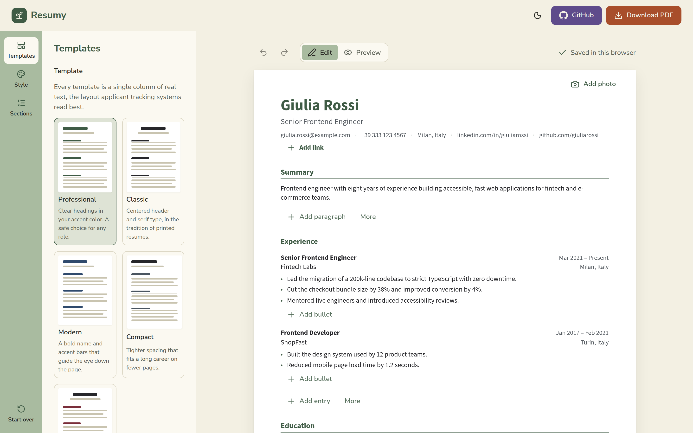
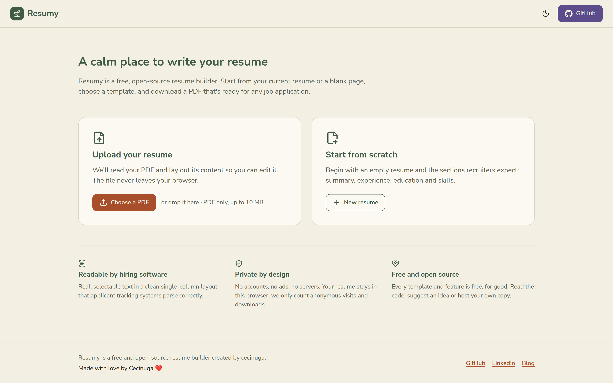
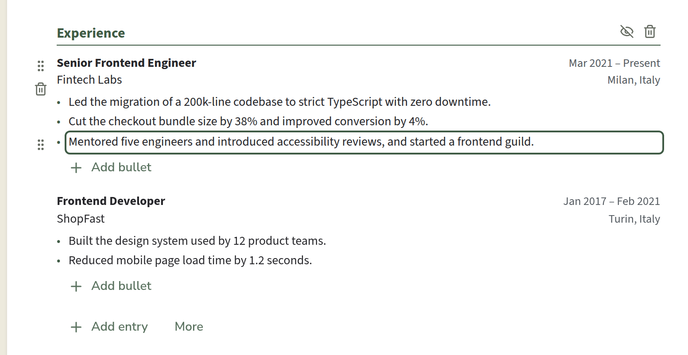
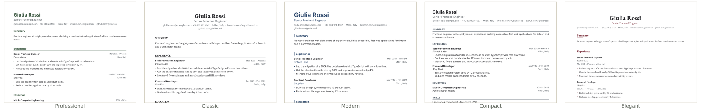
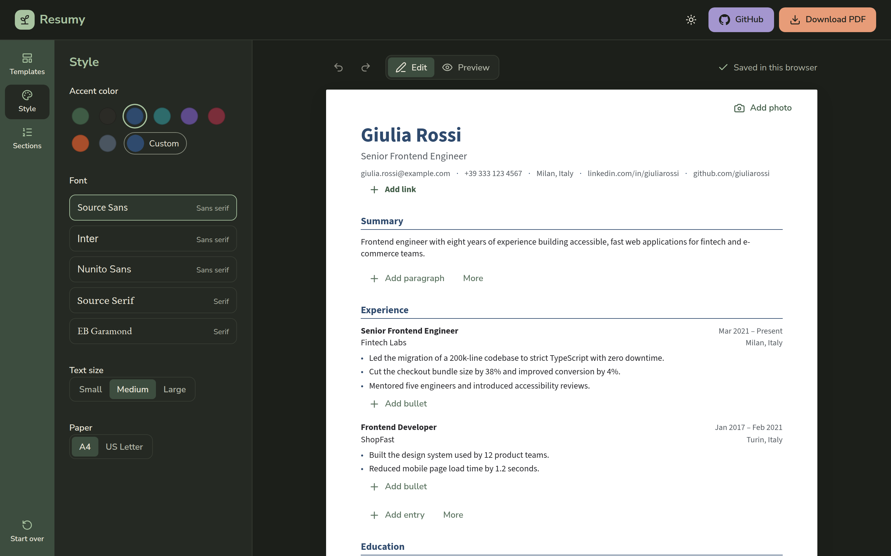
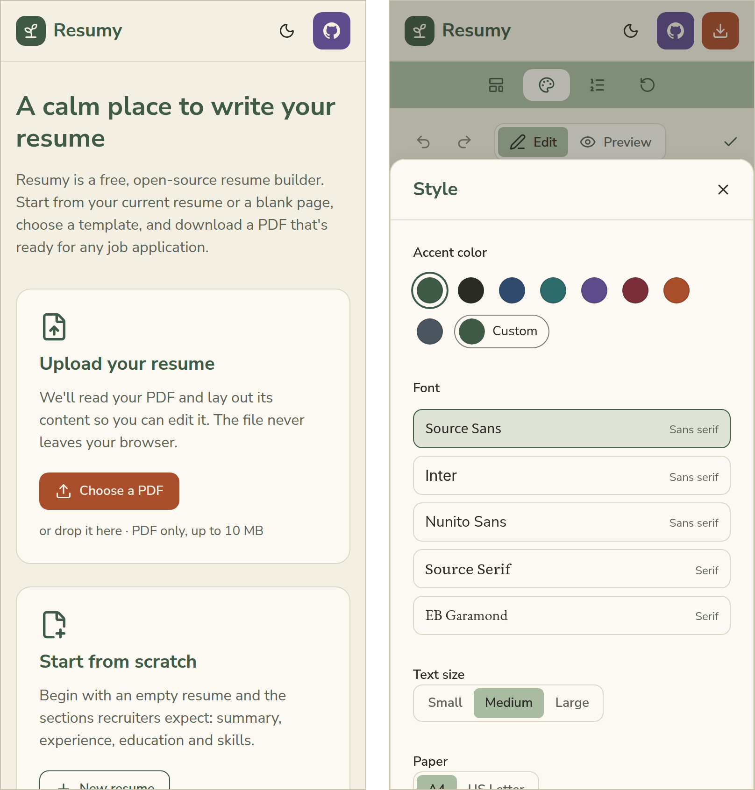

# Resumy

**A calm place to write your resume.** Resumy is a free, open-source resume builder. Bring the resume you already have or start from a blank page, edit it right on the page, pick a look you like and download a PDF that's ready for any job application.

**[Open Resumy →](https://resumysh.web.app)**

## Why Resumy

- **Free, for good.** No accounts, no ads, no paid templates, no watermark.
- **Private by design.** Your resume never leaves your device, and there is nothing to sign up for.
- **Read correctly by hiring software.** Many companies screen resumes with applicant tracking systems (ATS) before a person sees them. Every Resumy template keeps your resume as real, selectable text in a clean single column with familiar headings, the layout these systems read best.

## How to use it

### 1. Start from your resume or from scratch

Upload the resume you already have as a PDF, and Resumy lays out its content for you to edit: your name and contact details, summary, experience, education, skills and any other section. Or start with an empty resume that already has the sections recruiters expect.

### 2. Write on the page

Click any text to change it. Add bullets, entries and new sections where you need them, and drag an item by its dotted handle to move it, even into another section. You can rename any section and add one photo if you want one.

Removed something by mistake? Every change can be undone, from the toolbar or with <kbd>Ctrl</kbd>+<kbd>Z</kbd> (<kbd>⌘</kbd>+<kbd>Z</kbd> on a Mac).

### 3. Make it yours

Use the panels on the left to shape how your resume looks:

- **Templates:** choose from Professional, Classic, Modern, Compact and Elegant.
- **Style:** pick an accent color, a font, the text size, and A4 or US Letter paper.
- **Sections:** reorder sections, hide the ones you don't need for this application, or add new ones such as projects, certifications, languages, volunteering, awards or interests.

Switch to **Preview** at any time to see your resume page by page, exactly as the PDF will break it. The toolbar always tells you how many pages it fills.

### 4. Download your PDF

Press **Download PDF** in the top right corner. The file is named after you, ready to attach to an application. Web addresses and emails in it, from your contact details to a link in a bullet, are clickable.

## Your resume stays with you

- **Nothing is uploaded.** Your PDF is read, and your new one is created, inside your browser.
- **Your work is saved as you type**, in this browser only. Come back later and pick up where you left off with **Continue editing**, or press **Start over** to clear it.
- **Keep your PDF.** Clearing your browser data also deletes your draft. The PDF you download is your copy: upload it to Resumy again whenever you want to update it, and it comes back exactly as you left it, template and colors included. It holds only what it prints: hidden sections stay in your browser.
- **Only counts, no cookies.** Resumy counts visits, new resumes, uploads and downloads to know whether it's useful, without storing cookies or any identifier on your device. It never sees what you write, and it doesn't count you at all if your browser asks sites not to track you.

## Light or dark, on any screen

Resumy follows your device's light or dark setting, and you can switch it from the header. It works on phones and tablets too: the panels slide up from the bottom of the screen.

  

## Install it, use it offline

Resumy can live on your computer or phone like any other app, with its own icon and window. In Chrome or Edge, press the install button in the header or in the address bar. On an iPhone or iPad, tap **Share**, then **Add to Home Screen**.

Once you've opened Resumy, it works without an internet connection too, uploading and downloading PDFs included. When there's a new version, Resumy lets you know and switches to it when you choose **Reload**.

## Tips for importing a resume

- Resumy reads PDFs that contain real text, like the ones exported from Word, Google Docs or another resume builder. A scanned or photographed resume is just a picture, so there's nothing to read: start from scratch instead.
- Section headings are recognized in English, Italian, Spanish, French and German.
- Resumes with two columns or unusual layouts may need some tidying after the import. Resumy marks the entries that look misread; give everything a quick read before you download.

## Feedback and contributing

Found a bug or have an idea? [Open an issue](https://github.com/cecinuga/resumy/issues). If you want to run Resumy yourself or help build it, see [CONTRIBUTING.md](CONTRIBUTING.md).

## License

[MIT](LICENSE): free to use, change and share.

Made with love by Cecinuga ❤️ · [GitHub](https://github.com/cecinuga) · [LinkedIn](https://www.linkedin.com/in/matteommarchetti) · [Blog](https://cecinuga.dev)
